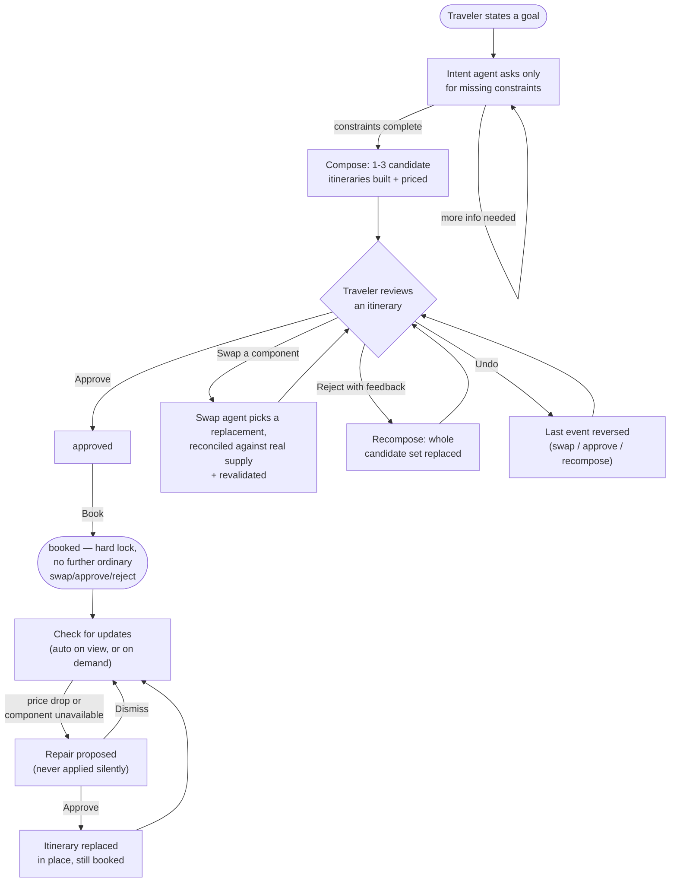
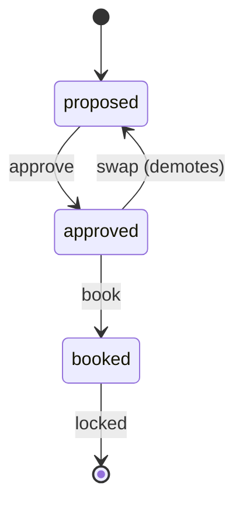

# Trip Architect

**Live demo: [trip-architect.onrender.com](https://trip-architect.onrender.com)**
(free-tier hosting — may take ~30s to wake up on the first request).

Tell us the trip you want; approve the trip we build; change anything,
anytime — with the agent keeping the whole plan consistent.

A demo-quality prototype of an AI travel agent: a short conversation elicits
your constraints (destination, dates, budget, party, non-negotiables), an
agent composes 1–3 coherent candidate itineraries from a small mocked supply
catalog, and every plan is a reviewable object you can approve, swap a
component of, reject with feedback, or undo — before anything is "booked."

## What this is (and isn't)

- **Mocked supply, mock booking.** No real flight/hotel APIs, no real
  payments. Inventory is a small fixture catalog covering Lisbon, Kyoto, and
  Barcelona (`app/supply/fixtures/`).
- **Explanations are computed, not generated.** Every component's "why" and
  every swap's diff/warnings are computed deterministically from the actual
  supply data (`app/supply/rationale.py`, `app/supply/revalidate.py`) —
  the LLM selects and writes summary/identity text, but never authors a
  factual claim about price, dates, or cancellation policy.
- **Post-booking monitoring, demo-triggered.** Once booked, the same agent
  keeps watching: price drops and "component no longer available" disruptions
  are proposed as repairs the traveler approves or dismisses — never applied
  silently. Since the mocked supply never changes on its own, a market change
  is triggered explicitly (UI demo controls or `/admin/*` routes) rather than
  drifting in the background. See "Post-booking monitoring" below.

## Tech stack

| Layer | Choice |
|---|---|
| Language / runtime | Python 3.13 |
| Agent orchestration | [Microsoft Agent Framework](https://github.com/microsoft/agent-framework) — `agent-framework-core`, `agent-framework-openai` |
| LLM provider | Azure OpenAI (via an Azure AI Foundry resource's Azure-OpenAI-compatible endpoint, API-key auth) |
| LLM model | Not hardcoded — set by `AZURE_OPENAI_CHAT_DEPLOYMENT_NAME` (`.env`), whatever chat-capable model your Azure OpenAI/Foundry resource has deployed under that name. This deployment currently runs `gpt-5.4-nano`. |
| Web/API framework | FastAPI, served by Uvicorn |
| UI | Gradio `Blocks`, mounted onto the FastAPI app (single process, one port) |
| Data validation / models | Pydantic v2, `pydantic-settings` for config |
| Supply data | Static JSON fixtures (no database) |
| State | In-memory, process-local (`PlanStore`, `SessionStore`) — no persistence layer |
| Testing | `pytest` + `pytest-asyncio`, `httpx`/FastAPI `TestClient`; a hand-rolled `StubAgent` duck-types the real `Agent` class so orchestration/store/reconciliation logic is tested for real without live model calls |
| Agent quality evals | `evals/` — a custom harness reusing the app's own deterministic logic (`revalidate()`, supply search) for scoring, plus Microsoft Agent Framework's `LocalEvaluator`/`evaluate_agent`/`tool_called_check` for tool-use verification |
| Containerization | Docker (`python:3.13-slim` base); one image, portable across hosts via a `$PORT`-aware entrypoint |
| Deployment | Render (Docker web service, current live host); Hugging Face Spaces also supported (Docker SDK) |
| Source control / CI hosting | GitHub (private repo) |
| Dev tooling | VS Code `launch.json`/`settings.json` for debugging the app and tests without `--reload` (so breakpoints attach to the real worker process) |

See `requirements.txt` for exact version floors and `Dockerfile` for the
runtime image.

## How it works



Every step in that loop is either the traveler's own action or something
they explicitly triggered (Approve/Swap/Reject/Book/Approve repair) —
nothing executes or spends money without an explicit click.

## Architecture


- **Agents** (`app/agents/`): three Microsoft Agent Framework `Agent`
  instances over Azure OpenAI — intent elicitation, itinerary composition,
  and component swap — each with its own prompt and tool set.
- **Service layer** (`app/services/trip_service.py`): the single
  implementation of "what happens when the traveler does X." Both the REST
  API and the Gradio UI call this layer directly; neither re-implements
  orchestration.
- **Store** (`app/store/`): in-memory, process-local `PlanStore` and
  `SessionStore`. Undo is a typed, plan-level event log (not a version
  stack), so it can reverse a swap, an approve, or a whole recompose
  uniformly.
- **API** (`app/api/`) + **UI** (`app/ui/gradio_app.py`): FastAPI routes and
  a Gradio `Blocks` UI, mounted onto the same app (`app/main.py`).
- **The LLM never authors a fact you can compute.** Rationale text, supply
  prices/dates/cancellation policies, total costs, and swap diffs/warnings
  are all computed deterministically in Python from real fixture data —
  the LLM's job is selection, identity/summary text, and day-scheduling
  only. See `app/supply/{reconcile,rationale,revalidate}.py`.

### Itinerary lifecycle



A few things this diagram simplifies, spelled out:
- Composition's raw output defaults to `draft` (the Pydantic field default),
  but every itinerary is reconciled and priced before it's ever handed to
  the store — so `proposed` is the only status the traveler (or the API)
  ever actually sees at that point.
- Swapping a component on an itinerary that's still `proposed` leaves its
  status unchanged (only an *approved* itinerary gets demoted back to
  `proposed` — content never changes silently under an "approved" label).
- `booked` is a hard lock on *ordinary* swap/approve/reject — the one
  deliberate exception is a traveler-approved post-booking repair (see
  below), which replaces the itinerary in place without unlocking the plan.
- **Undo** isn't a forward transition — it pops the plan's last event
  (`app/store/plan_store.py`'s typed `PlanEvent` log) and restores whatever
  came before it, whether that event was a swap, an approve, or a book.
- **Reject-with-feedback** is plan-level, not itinerary-level: it replaces
  the *whole* candidate set rather than changing one itinerary's status.
  `ItineraryStatus.REJECTED` exists on the model but isn't currently
  assigned by any code path — rejected candidates are simply dropped from
  the active set (and retained in the event log for undo).

## Post-booking monitoring

Booking isn't a dead end. Once a plan is `booked`, `TripService.check_for_updates()`
(`app/supply/monitor.py`, deterministic — no LLM call for detection) runs
automatically right after booking and whenever the booked plan is
redisplayed, plus on demand via a "Check for updates" button. It looks for
two things against the booked itinerary's components:

- **Price drops** — a component whose supply price fell since it was booked
  (or since the last repair), still inside its cancellation window. Building
  the repriced replacement itinerary is pure Python (`reconcile_and_price`),
  no LLM involved.
- **Unavailable components** — a component no longer present in supply at
  all. Here the swap agent picks a real replacement, using the same
  `swap_component()` call an ordinary swap uses, with feedback that makes
  the "this one's actually gone, don't re-pick it" constraint explicit.

Either way, the result is a `ProposedRepair` — **proposed, never silently
applied**. The traveler approves it (replaces the booked itinerary with the
precomputed replacement, logs an undoable `REPAIR_APPLIED` event, plan stays
`booked`) or dismisses it. A repair whose condition resolves before it's
acted on (e.g. the price change gets reset) is auto-dismissed the next time
`check_for_updates` runs, rather than lingering.

**Why triggers are explicit, not background drift:** the mocked supply
(`app/supply/provider.py`'s fixture dicts) never changes on its own, and
there's no background scheduler in this app (Gradio's UI is request-driven;
free-tier hosting also sleeps after inactivity). So "the market changed" is
simulated via an explicit action that runs *inside* the one live `uvicorn`
process — either the Gradio UI's demo controls on the booked-trip panel, or
the equivalent `POST /admin/plans/{plan_id}/simulate-price-drop`,
`/simulate-unavailable`, and `/admin/reset` routes. A standalone script
mutating `provider.py`'s module-level fixtures would touch its own,
invisible copy of that memory, not the server's — see
`app/api/admin.py`'s docstring.

## Running locally

```bash
python3 -m venv .venv && source .venv/bin/activate
pip install -r requirements.txt
cp .env.example .env   # fill in your Azure OpenAI values
PYTHONPATH=. uvicorn app.main:app --reload
```

Open `http://127.0.0.1:8000/` for the Gradio UI, or `/docs` for the REST API.

Required environment variables (see `.env.example`):

```
AZURE_OPENAI_API_KEY=
AZURE_OPENAI_ENDPOINT=            # the Azure-OpenAI-compatible endpoint from
                                   # your Foundry resource, not the project endpoint
AZURE_OPENAI_CHAT_DEPLOYMENT_NAME=
AZURE_OPENAI_API_VERSION=
```

## Testing

```bash
PYTHONPATH=. pytest
```

Runs entirely offline against stubbed agents — no Azure OpenAI credentials
needed. One test (`test_itinerary_candidates_structured_output_round_trip`)
skips automatically unless `AZURE_OPENAI_API_KEY` is set; it's a smoke test
against the real deployment, not part of normal CI.

The `scripts/manual_test_*.py` scripts exercise the real agents end-to-end
(intent conversation, composition, swap, full API flow) and require live
credentials — run them by hand when changing agent/prompt behavior.

## Eval harness

`pytest` only covers deterministic logic (store, pricing, reconciliation)
against a stubbed agent — it can't tell you whether the *real* agents
actually respect a traveler's constraints, or whether a prompt change
helped or hurt. `evals/` is a separate, hand-run harness for that: it scores
the real `composition_agent`/`swap_agent` against a fixed 10-scenario battery
(budget edge cases, family constraints, ambiguous destinations, conflicting
preferences, price- and vibe-driven swaps, and a post-booking disruption
repair that genuinely marks a component unavailable in supply before the
agent runs) using deterministic checks — reusing `revalidate()` and the
supply search functions rather than reinventing scoring rules — plus a
`tool_called_check` pass (via Microsoft Agent Framework's own,
`@experimental`-marked eval tooling) confirming the agents actually call the
search tools instead of inventing supply.

```bash
python -m evals.run                              # run the battery once
python -m evals.run --repeat 3                    # pass RATE per check across 3 runs (one run is noise)
python -m evals.run --compare OLD.json NEW.json   # diff two saved reports (evals/results/*.json, gitignored)
```

Costs real Azure OpenAI calls — not part of CI, run it by hand whenever
changing a prompt in `app/agents/prompts.py`. It caught two real issues on
its first live runs, reproduced consistently across repeats (not LLM
noise), both since fixed: composition only honoring an explicit
`family-friendly` non-negotiable in 1 of 3 candidates, and an activity swap
silently failing with a confusing error instead of succeeding — not a
crash (the REST API and Gradio UI both already handle it gracefully, via a
409 and an inline error message respectively), but a legitimate,
achievable request that didn't get fulfilled, caused by a detection bug
that assumed activity ids are unique within one itinerary when a small
fixture catalog and a multi-day trip make duplicates the norm. See
`evals/scenarios.py` for the full battery and why each scenario exists.

## Known limitations (prototype scope)

- **Single worker, in-memory state.** `--workers 1` in the Dockerfile is
  required, not optional — the stores are process-local, so more workers
  would silently split traffic across inconsistent copies of the same plan.
- **Ephemeral storage.** Hugging Face Spaces only allows writes to `/tmp`,
  and this app doesn't persist to disk at all — every plan/session is lost
  on restart. Acceptable for a demo, not for anything real.
- **No request locking across actions on the same plan.** Firing a second
  action (e.g. Undo) while a first one (e.g. Swap) is still waiting on its
  LLM call can act on stale state. The store's invariants prevent silent
  corruption (e.g. booking still requires `approved` status), but the
  traveler-visible behavior in that narrow window can be confusing. A
  busy-state lock in the UI would close this gap; not built for v1.
- **Post-booking monitoring reacts to simulated changes, not real market
  data.** There's no live pricing feed and no background scheduler — a
  price drop or disruption only exists because the demo controls (or the
  `/admin/*` routes) explicitly triggered it. The detection/repair/approve
  loop itself is real; what's simulated is the "something changed" signal.

## Deployment

The same `Dockerfile` works on either target below — it binds to `$PORT`
when set, falling back to 7860 (Hugging Face Spaces doesn't set `PORT`;
Render and similar PaaS hosts do).

### Hugging Face Spaces (Docker SDK)

Set these as Space **Repository secrets** (never commit them):
`AZURE_OPENAI_API_KEY`, `AZURE_OPENAI_ENDPOINT`,
`AZURE_OPENAI_CHAT_DEPLOYMENT_NAME`, `AZURE_OPENAI_API_VERSION`.

The Space builds `Dockerfile` and serves on port 7860 automatically once
those secrets are set.

**Known issue:** as of 2026-07, creating a *new* Docker/Gradio Space on a
free-tier account may return `402 Payment Required` even with room under
the documented limits — HF's own error message says this requires PRO
(`huggingface.co/pro`), and it reproduced for both Docker and native Gradio
SDKs, and persisted even after pausing another Space. No official
documentation confirms the exact mechanism; treat it as something to
verify against your account before assuming it'll work.

### Render (Docker web service) — currently deployed here

This is the live deployment: **https://trip-architect.onrender.com** (free
tier — sleeps after inactivity, ~30s cold start on the first request after
a while). Used in place of HF Spaces because of the issue above.

A Blueprint spec is already in the repo: `render.yaml`.

1. Push this repo to GitHub (already done: `github.com/samir72/trip-architect`).
2. In the Render dashboard: **New → Blueprint**, connect the GitHub repo.
   Render reads `render.yaml` and provisions a free Docker web service from
   the same `Dockerfile` used for HF Spaces.
3. When prompted, fill in the four `AZURE_OPENAI_*` environment variables
   (declared `sync: false` in `render.yaml`, so Render prompts for them
   rather than reading them from the repo).
4. Render injects `PORT` (default 10000); the Dockerfile's `CMD` already
   respects it.
