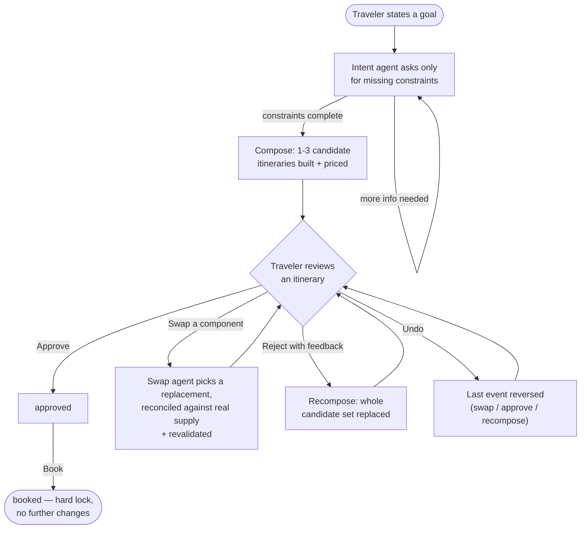
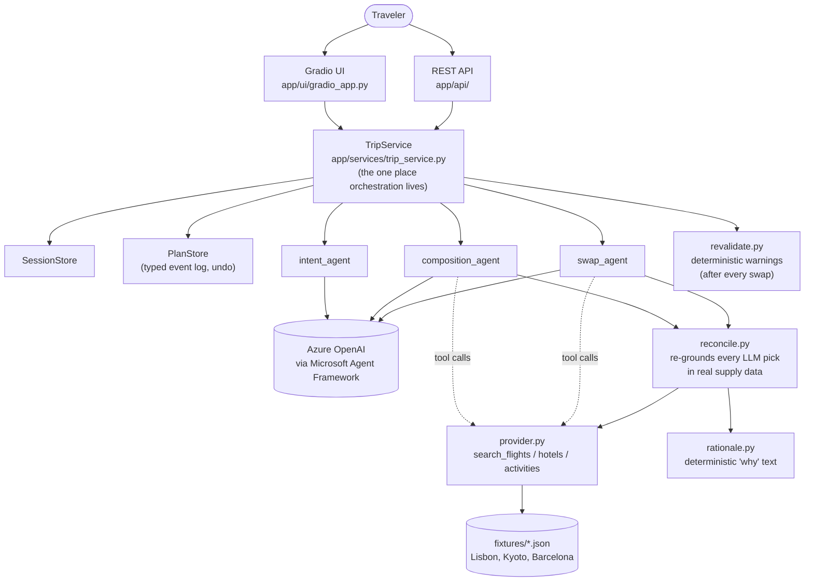
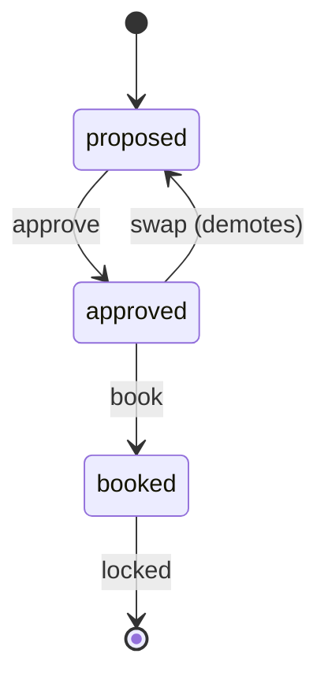

# Trip Architect

Tell us the trip you want; approve the trip we build; change anything,
anytime — with the agent keeping the whole plan consistent.

A demo-quality prototype of an AI travel agent: a short conversation elicits
your constraints (destination, dates, budget, party, non-negotiables), an
agent composes 1–3 coherent candidate itineraries from a small mocked supply
catalog, and every plan is a reviewable object you can approve, swap a
component of, reject with feedback, or undo — before anything is "booked."

## What this is (and isn't)

- **Mocked supply, mock booking.** No real flight/hotel APIs, no real
  payments. Inventory is a small fixture catalog covering Lisbon, Kyoto, and
  Barcelona (`app/supply/fixtures/`).
- **Explanations are computed, not generated.** Every component's "why" and
  every swap's diff/warnings are computed deterministically from the actual
  supply data (`app/supply/rationale.py`, `app/supply/revalidate.py`) —
  the LLM selects and writes summary/identity text, but never authors a
  factual claim about price, dates, or cancellation policy.
- **No post-booking monitoring.** Price-drop/disruption watching is a
  deliberately deferred later phase; the data model captures what it would
  need (cancellation deadlines, price snapshots) without building the loop.

## How it works



Every step in that loop is either the traveler's own action or something
they explicitly triggered (Approve/Swap/Reject/Book) — nothing executes or
spends money without an explicit click.

## Architecture



- **Agents** (`app/agents/`): three Microsoft Agent Framework `Agent`
  instances over Azure OpenAI — intent elicitation, itinerary composition,
  and component swap — each with its own prompt and tool set.
- **Service layer** (`app/services/trip_service.py`): the single
  implementation of "what happens when the traveler does X." Both the REST
  API and the Gradio UI call this layer directly; neither re-implements
  orchestration.
- **Store** (`app/store/`): in-memory, process-local `PlanStore` and
  `SessionStore`. Undo is a typed, plan-level event log (not a version
  stack), so it can reverse a swap, an approve, or a whole recompose
  uniformly.
- **API** (`app/api/`) + **UI** (`app/ui/gradio_app.py`): FastAPI routes and
  a Gradio `Blocks` UI, mounted onto the same app (`app/main.py`).
- **The LLM never authors a fact you can compute.** Rationale text, supply
  prices/dates/cancellation policies, total costs, and swap diffs/warnings
  are all computed deterministically in Python from real fixture data —
  the LLM's job is selection, identity/summary text, and day-scheduling
  only. See `app/supply/{reconcile,rationale,revalidate}.py`.

### Itinerary lifecycle



A few things this diagram simplifies, spelled out:
- Composition's raw output defaults to `draft` (the Pydantic field default),
  but every itinerary is reconciled and priced before it's ever handed to
  the store — so `proposed` is the only status the traveler (or the API)
  ever actually sees at that point.
- Swapping a component on an itinerary that's still `proposed` leaves its
  status unchanged (only an *approved* itinerary gets demoted back to
  `proposed` — content never changes silently under an "approved" label).
- `booked` is a hard lock: no further swap/approve/reject/undo on that plan.
- **Undo** isn't a forward transition — it pops the plan's last event
  (`app/store/plan_store.py`'s typed `PlanEvent` log) and restores whatever
  came before it, whether that event was a swap, an approve, or a book.
- **Reject-with-feedback** is plan-level, not itinerary-level: it replaces
  the *whole* candidate set rather than changing one itinerary's status.
  `ItineraryStatus.REJECTED` exists on the model but isn't currently
  assigned by any code path — rejected candidates are simply dropped from
  the active set (and retained in the event log for undo).

## Running locally

```bash
python3 -m venv .venv && source .venv/bin/activate
pip install -r requirements.txt
cp .env.example .env   # fill in your Azure OpenAI values
PYTHONPATH=. uvicorn app.main:app --reload
```

Open `http://127.0.0.1:8000/` for the Gradio UI, or `/docs` for the REST API.

Required environment variables (see `.env.example`):

```
AZURE_OPENAI_API_KEY=
AZURE_OPENAI_ENDPOINT=            # the Azure-OpenAI-compatible endpoint from
                                   # your Foundry resource, not the project endpoint
AZURE_OPENAI_CHAT_DEPLOYMENT_NAME=
AZURE_OPENAI_API_VERSION=
```

## Testing

```bash
PYTHONPATH=. pytest
```

Runs entirely offline against stubbed agents — no Azure OpenAI credentials
needed. One test (`test_itinerary_candidates_structured_output_round_trip`)
skips automatically unless `AZURE_OPENAI_API_KEY` is set; it's a smoke test
against the real deployment, not part of normal CI.

The `scripts/manual_test_*.py` scripts exercise the real agents end-to-end
(intent conversation, composition, swap, full API flow) and require live
credentials — run them by hand when changing agent/prompt behavior.

## Known limitations (prototype scope)

- **Single worker, in-memory state.** `--workers 1` in the Dockerfile is
  required, not optional — the stores are process-local, so more workers
  would silently split traffic across inconsistent copies of the same plan.
- **Ephemeral storage.** Hugging Face Spaces only allows writes to `/tmp`,
  and this app doesn't persist to disk at all — every plan/session is lost
  on restart. Acceptable for a demo, not for anything real.
- **No request locking across actions on the same plan.** Firing a second
  action (e.g. Undo) while a first one (e.g. Swap) is still waiting on its
  LLM call can act on stale state. The store's invariants prevent silent
  corruption (e.g. booking still requires `approved` status), but the
  traveler-visible behavior in that narrow window can be confusing. A
  busy-state lock in the UI would close this gap; not built for v1.

## Deployment

The same `Dockerfile` works on either target below — it binds to `$PORT`
when set, falling back to 7860 (Hugging Face Spaces doesn't set `PORT`;
Render and similar PaaS hosts do).

### Hugging Face Spaces (Docker SDK)

Set these as Space **Repository secrets** (never commit them):
`AZURE_OPENAI_API_KEY`, `AZURE_OPENAI_ENDPOINT`,
`AZURE_OPENAI_CHAT_DEPLOYMENT_NAME`, `AZURE_OPENAI_API_VERSION`.

The Space builds `Dockerfile` and serves on port 7860 automatically once
those secrets are set.

**Known issue:** as of 2026-07, creating a *new* Docker/Gradio Space on a
free-tier account may return `402 Payment Required` even with room under
the documented limits — HF's own error message says this requires PRO
(`huggingface.co/pro`), and it reproduced for both Docker and native Gradio
SDKs, and persisted even after pausing another Space. No official
documentation confirms the exact mechanism; treat it as something to
verify against your account before assuming it'll work.

### Render (Docker web service) — used when HF Spaces isn't available

A Blueprint spec is already in the repo: `render.yaml`.

1. Push this repo to GitHub (already done: `github.com/samir72/trip-architect`).
2. In the Render dashboard: **New → Blueprint**, connect the GitHub repo.
   Render reads `render.yaml` and provisions a free Docker web service from
   the same `Dockerfile` used for HF Spaces.
3. When prompted, fill in the four `AZURE_OPENAI_*` environment variables
   (declared `sync: false` in `render.yaml`, so Render prompts for them
   rather than reading them from the repo).
4. Render injects `PORT` (default 10000); the Dockerfile's `CMD` already
   respects it.
